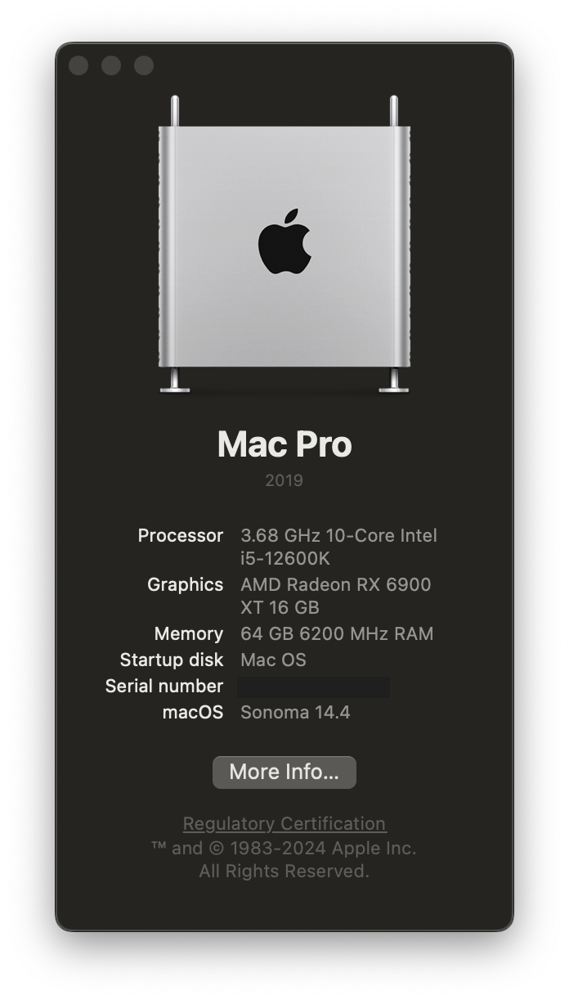

# Hackintosh-Gigabyte-Z690-Aorus-Ultra-12600K-RX6900-XT
EFI Folder  
Latest Mac OS: 14.4 (Sonoma)  
Current OpenCore: 0.9.9

## Hardware
Motherboard: Gigabyte Z690 Aorus Ultra DDR5  
CPU: Intel Core i5-12600K (Alder Lake)  
Graphics: AMD Radeon RX 6900 XT  
RAM: Corsair Vengeance DDR5 64GB (2x32GB) 6400 MHz (XMP)  
Storage: Samsung SSD 980 PRO with Heatsink 2TB  
Ethernet: Intel I225-V  
Wifi: Intel AX210

## Bios
Version: F27 (22/09/2023)

Settings:
- To be added

## What works
- Mac OS Sonoma
- Audio
- Video (HDMI/DP)
- USB
- Ethernet
- Wifi
- USB Mapping
- iCloud/iMessage/FaceTime
- Shutdown/Reboot

## What doesn't work (or haven't been tested yet)
- Bluetooth
- Sleep
- Temperature monitoring (CPU/GPU)
- DRM content (Netflix, ATV+, Airplay 2 mirroring etc)
- Update to newer macOS builds

## SSDTs
- SSDT-AWAC
- SSDT-EC-USBX
- SSDT-HPET
- SSDT-PLUG-ALT
- SSDT-USBW

## Kexts used:
- AirportItlwm.kext
- AppleALC.kext
- AppleIGC.kext
- BlueToolFixup.kext
- BrcmFirmwareData.kext
- BrcmPatchRAM3.kext
- CPUFriend.kext
- CPUFriendDataProvider.kext
- CpuTopologyRebuilt.kext
- CpuTscSync.kext
- FeatureUnlock.kext
- Lilu.kext
- NVMeFix.kext
- RadeonSensor.kext
- RestrictEvents.kext
- SMCProcessor.kext
- SMCRadeonGPU.kext
- SMCSuperIO.kext
- USBToolBox.kext
- USBWakeFixup.kext
- UTBMap.kext
- VirtualSMC.kext
- WhateverGreen.kext
## Benchmarks

## Credits
Dortania install guide
https://dortania.github.io/OpenCore-Install-Guide/

OpenCore Visual Beginners Guide
https://chriswayg.gitbook.io/opencore-visual-beginners-guide/advanced-topics/using-alder-lake
